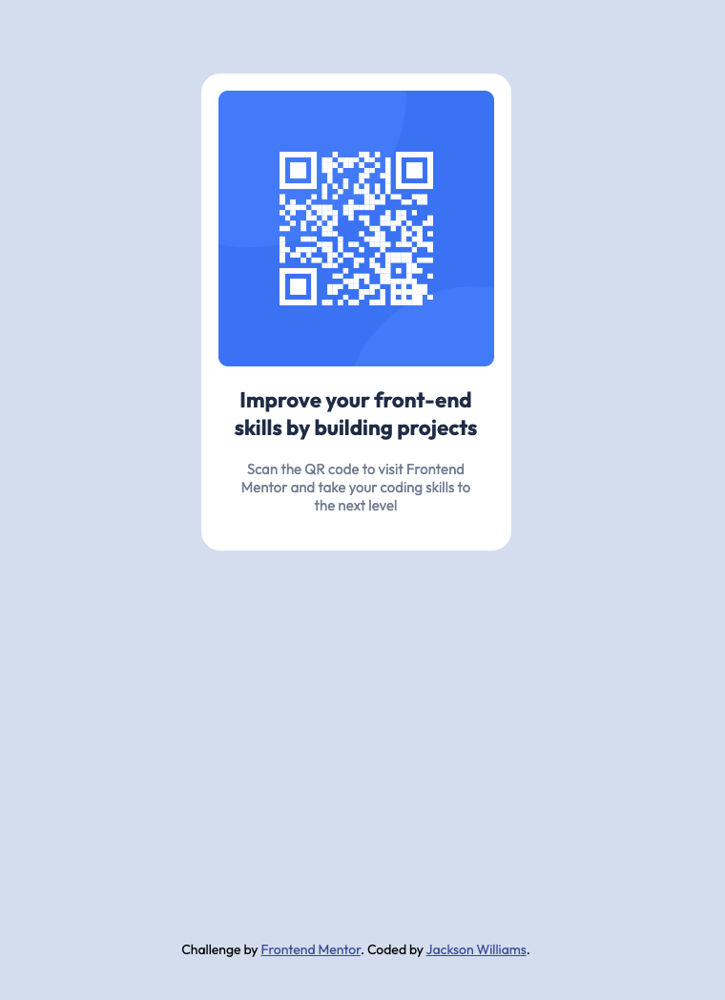

# Frontend Mentor - QR code component solution

This is a solution to the [QR code component challenge on Frontend Mentor](https://www.frontendmentor.io/challenges/qr-code-component-iux_sIO_H). Frontend Mentor challenges help you improve your coding skills by building realistic projects.

## Table of contents

- [Overview](#overview)
  - [Screenshot](#screenshot)
  - [Links](#links)
- [My process](#my-process)
  - [Built with](#built-with)
  - [What I learned](#what-i-learned)
  - [Continued development](#continued-development)
- [Author](#author)

## Overview

I built this simple QR component using flexbox and grid, applying the knowledge I have learnt from the past week from learning basic HTML & CSS. I had a lot of fun building this and cant wait to learn more and build more projects!

### Screenshot

### Links

- Solution URL: [Add solution URL here](https://your-solution-url.com)
- Live Site URL: [Add live site URL here](https://your-live-site-url.com)

## My process

### Built with

- Semantic HTML5 markup
- CSS custom properties
- Flexbox
- CSS Grid

### What I learned

I learned by using grid I could center the whole card on the page and also setting the image to max-width: 100% would shrink it to fit the container.

### Continued development

I would like to get better using Flexbox and CSS Grid and when to use them and why.

## Author

- Frontend Mentor - [@JackoWill](https://www.frontendmentor.io/profile/JackoWill)
